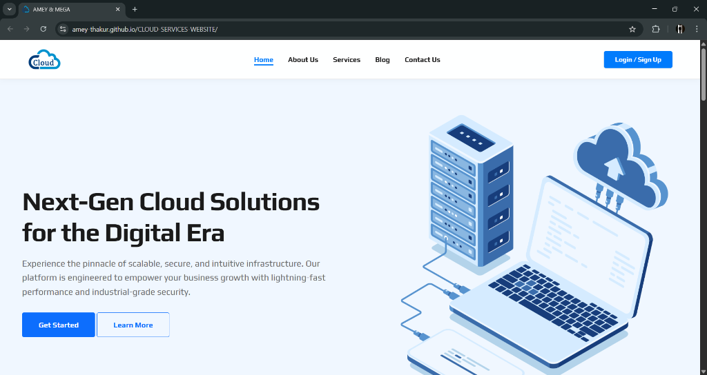
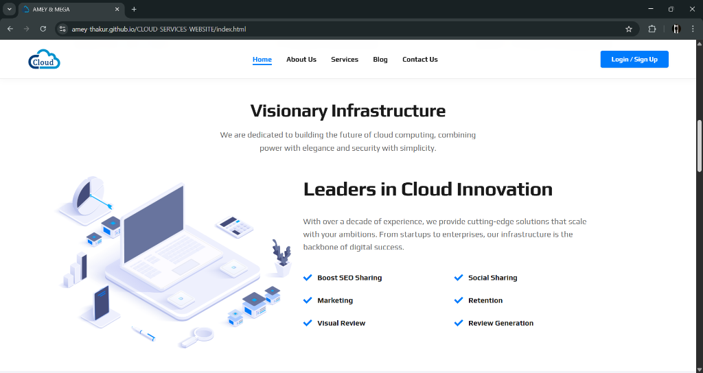
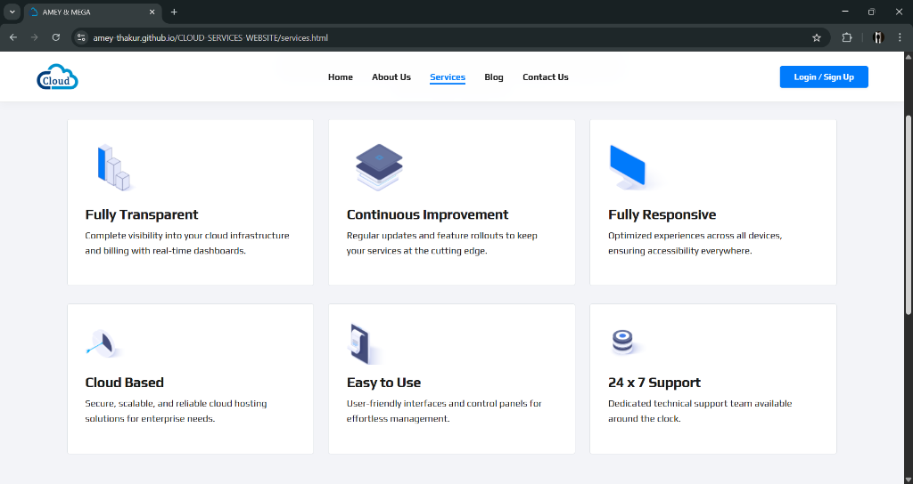
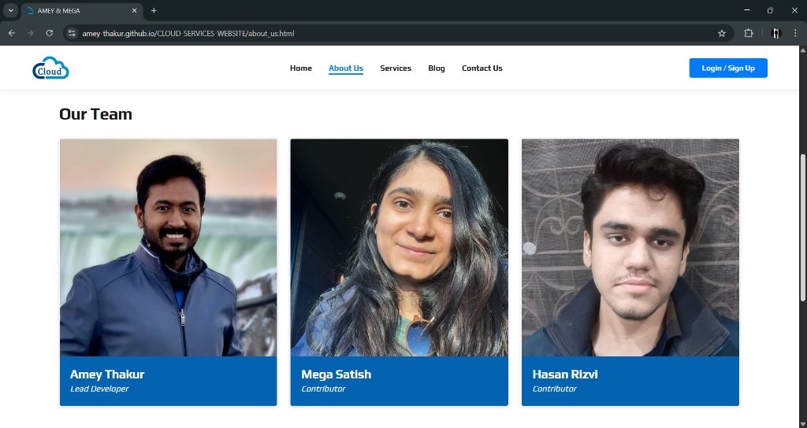
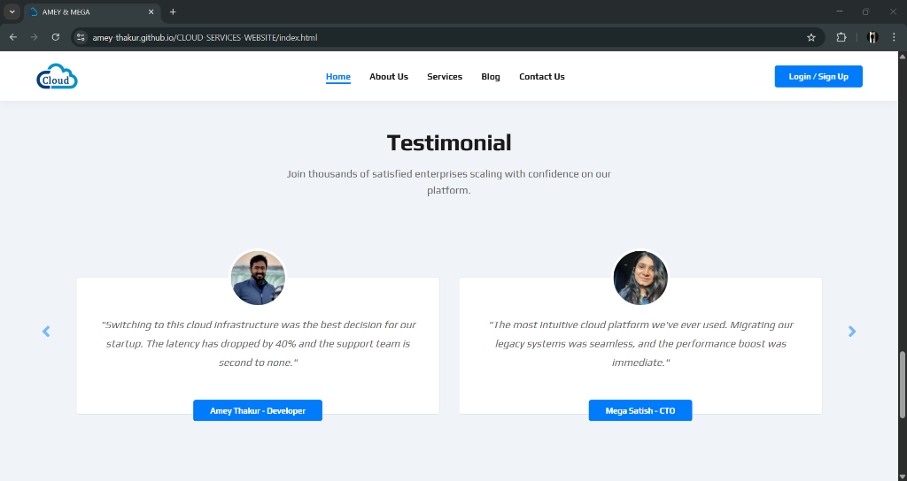
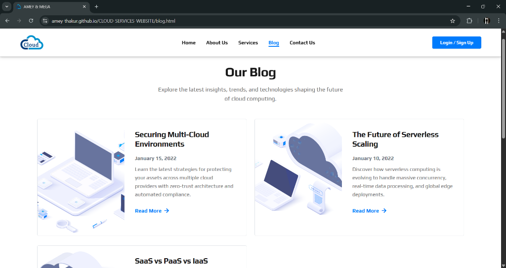
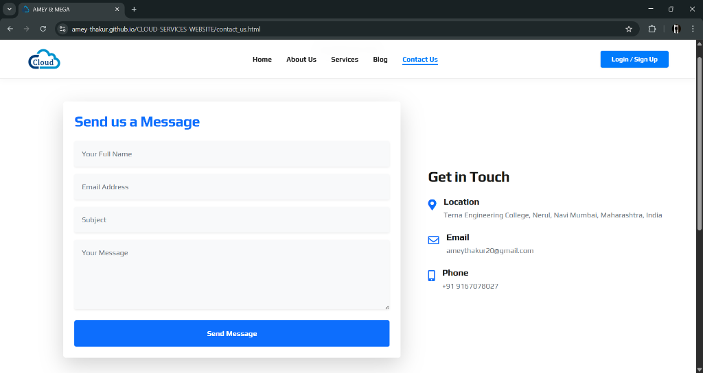
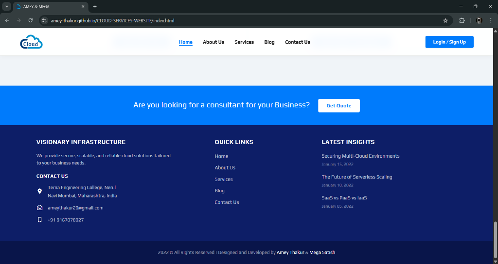

<div align="center">

  <a name="readme-top"></a>
  # Cloud Services Website

  [](LICENSE)
  
  [](https://github.com/Amey-Thakur/CLOUD-SERVICES-WEBSITE)
  [](https://github.com/Amey-Thakur/CLOUD-SERVICES-WEBSITE)

  A modern, responsive landing page template designed for cloud hosting and service providers, featuring a clean aesthetic and semantic structure.

  **[Source Code](Source%20Code/)** &nbsp;·&nbsp; **[Technical Specification](docs/SPECIFICATION.md)** &nbsp;·&nbsp; **[Live Demo](https://amey-thakur.github.io/CLOUD-SERVICES-WEBSITE/)**

</div>

---

<div align="center">

  [Authors](#authors) &nbsp;·&nbsp; [Overview](#overview) &nbsp;·&nbsp; [Features](#features) &nbsp;·&nbsp; [Structure](#project-structure) &nbsp;·&nbsp; [Results](#results) &nbsp;·&nbsp; [Quick Start](#quick-start) &nbsp;·&nbsp; [Usage Guidelines](#usage-guidelines) &nbsp;·&nbsp; [License](#license) &nbsp;·&nbsp; [About](#about-this-repository) &nbsp;·&nbsp; [Acknowledgments](#acknowledgments)

</div>

---

<!-- AUTHORS -->
<div align="center">

  <a name="authors"></a>
  ## Authors

  **Terna Engineering College | Computer Engineering | Batch of 2022**

| <a href="https://github.com/Amey-Thakur"></a><br>[**Amey Thakur**](https://github.com/Amey-Thakur)<br><br>[](https://orcid.org/0000-0001-5644-1575) | <a href="https://github.com/msatmod"></a><br>[**Mega Satish**](https://github.com/msatmod)<br><br>[](https://orcid.org/0000-0002-1844-9557) |
| :---: | :---: |

</div>

> [!IMPORTANT]
> ### 🤝🏻 Special Acknowledgement
> *Special thanks to **[Mega Satish](https://github.com/msatmod)** for her meaningful contributions, guidance, and support that helped shape this work.*

---

<!-- OVERVIEW -->
<a name="overview"></a>
## Overview

The **Cloud Services Website** is a responsive web platform that exemplifies **Information Architecture (IA)** and **Hick’s Law** in modern web design. The project focuses on presenting complex service hierarchies in a digestible, navigable format.

### HMI Principles
The development of this interface was guided by core **Human-Machine Interaction** paradigms:
*   **Readability**: Utilizing typographic hierarchy and generous whitespace to reduce visual crowding.
*   **Visual Consistency**: Maintaining uniform design tokens (color, spacing) to allow users to build a reliable mental model of the navigation structure.

> [!TIP]
> **Visual Hierarchy & Scanning**
>
> The landing page layout is optimized for **F-Pattern scanning**, placing high-priority value propositions and Call-to-Action (CTA) buttons along the natural reading path. This deliberate structuring of information ensures that users capture the most critical content within the first few seconds of interaction, adhering to the HMI principle of **Efficiency of Use**.

---

<!-- FEATURES -->
<a name="features"></a>
## Features

| Feature | Description |
|---------|-------------|
| **Modern UI/UX** | Clean typography, consistent color palette, and whitespace utilization. |
| **Grid Layout** | CSS Grid and Flexbox used (implicitly or explicitly) for structural alignment. |
| **Responsive Design** | Fluid layouts that adapt to mobile, tablet, and desktop screens. |
| **Pure CSS Implementation** | Styling achieved without reliance on heavy external frameworks. |
| **Asset Optimization** | Fast loading times due to optimized code structure. |
| **Interactive UX** | **Polished Hover Effects** on navigation and contact links for intuitive feedback. |
| **Smart Carousels** | **Clean Testimonial & Blog Sliders** optimized for clutter-free readability. |
| **Social Integration** | **High-Fidelity Social Media Poster** generated for project branding and sharing. |

> [!NOTE]
> ### Interactive Polish: The Cloud Aesthetic
> We have refined the platform with a **Clean Blue Theme**, ensuring every element, from the centered carousel cards to the "hover-active" contact links, feels purposeful and premium. The visual language focuses on clarity and trust, essential for a cloud services provider. Complementing this experience, the application includes a custom-designed **Social Media Poster** that visually encapsulates the project's brand identity, signed by **Amey & Mega**.

### Tech Stack
- **Languages**: HTML5, CSS3, JavaScript (ES6+)
- **Logic**: jQuery (DOM Manipulation & Carousel Logic)
- **Imaging**: **FontAwesome 6** (Vector Iconography & Thematic Visuals)
- **UI System**: Premium Cloud Theme (Custom Vanilla CSS3)
- **Deployment**: GitHub Actions (Staging & Continuous Delivery Workflow)
- **Hosting**: GitHub Pages

---

<!-- STRUCTURE -->
<a name="project-structure"></a>
## Project Structure

```python
CLOUD-SERVICES-WEBSITE/
│
├── .github/                         # GitHub Actions & Automation
│   └── workflows/
│       └── deploy.yml               # Automated Staging & Deployment Flow
│
├── docs/                            # Technical Documentation
│   └── SPECIFICATION.md             # Architecture & Design Specification
│
├── Mega/                            # Archival Attribution Assets
│   ├── Filly.jpg                    # Companion (Filly)
│   └── Mega.png                     # Author Profile Image (Mega Satish)
│
├── Source Code/                     # Primary Application Layer
│   ├── assets/                      # Static Assets (CSS, JS, Images)
│   ├── 404.html                     # Error Page
│   ├── about_us.html                # Corporate Profile
│   ├── blog.html                    # Insights & News
│   ├── contact_us.html              # Inquiry Form
│   ├── favicon.png                  # Site Icon
│   ├── index.html                   # Landing Page
│   ├── poster.html                  # Social Media Preview Poster
│   └── services.html                # Service Offerings
│
├── .gitattributes                   # Git configuration
├── CITATION.cff                     # Scholarly Citation Metadata
├── codemeta.json                    # Machine-Readable Project Metadata
├── LICENSE                          # MIT License Terms
├── README.md                        # Comprehensive Archival Entrance
└── SECURITY.md                      # Security Policy & Protocol
```

---

<!-- RESULTS -->
<a name="results"></a>
## Results

<div align="center">
  <b>Landing Page Hero Section</b>
  <br><br>
  
  <br><br>

  <b>Visionary Infrastructure</b>
  <br><br>
  
  <br><br>

  <b>Service Offerings</b>
  <br><br>
  
  <br><br>

  <b>Our Team</b>
  <br><br>
  
  <br><br>

  <b>Client Testimonials</b>
  <br><br>
  
  <br><br>

  <b>Latest Insights (Blog)</b>
  <br><br>
  
  <br><br>

  <b>Contact Form</b>
  <br><br>
  
  <br><br>

  <b>Site Footer</b>
  <br><br>
  
</div>

---

<!-- QUICK START -->
<a name="quick-start"></a>
## Quick Start

### 1. Prerequisites
- **Browser**: Any modern standards-compliant web browser (Chrome, Firefox, Edge, Safari).
- **Environment**: No server-side runtime is required; this is a static client-side application.

> [!WARNING]
> **Local Execution**
>
> While the project can be executed by opening `index.html` directly, certain features may require an active internet connection to resolve external libraries correctly.

### 2. Setup & Deployment
1.  **Clone the Repository**:
    ```bash
    git clone https://github.com/Amey-Thakur/CLOUD-SERVICES-WEBSITE.git
    cd CLOUD-SERVICES-WEBSITE
    ```
2.  **Launch**:
    Open `Source Code/index.html` in your preferred browser.

---

<!-- =========================================================================================
                                     USAGE SECTION
     ========================================================================================= -->
## Usage Guidelines

This repository is openly shared to support learning and knowledge exchange across the academic community.

**For Students**  
Use this project as reference material for understanding interactive system design, web development patterns, and Human Machine Interaction principles. The source code is available for study to facilitate self-paced learning and exploration of user-centric design patterns.

**For Educators**  
This project may serve as a practical lab example or supplementary teaching resource for Human Machine Interaction and Human Machine Interaction Laboratory courses (`CSC801` & `CSL801`). Attribution is appreciated when utilizing content.

**For Researchers**  
The documentation and design approach may provide insights into academic project structuring and interactive web application development.

---

<!-- LICENSE -->
<a name="license"></a>
## License

This repository and all its creative and technical assets are made available under the **MIT License**. See the [LICENSE](LICENSE) file for complete terms.

> [!NOTE]
> **Summary**: You are free to share and adapt this content for any purpose, even commercially, as long as you provide appropriate attribution to the original authors.

Copyright © 2022 Amey Thakur & Mega Satish

---

<!-- ABOUT -->
<a name="about-this-repository"></a>
## About This Repository

**Created & Maintained by**: [Amey Thakur](https://github.com/Amey-Thakur) & [Mega Satish](https://github.com/msatmod)  
**Academic Journey**: Bachelor of Engineering in Computer Engineering (2018-2022)  
**Institution**: [Terna Engineering College](https://ternaengg.ac.in/), Navi Mumbai  
**University**: [University of Mumbai](https://mu.ac.in/)

This project features the **Cloud Services Website**, developed as a **Human Machine Interaction** project during the **8th Semester Computer Engineering** curriculum. It represents the application of design principles to create functional web interfaces.

**Connect:** [GitHub](https://github.com/Amey-Thakur) &nbsp;·&nbsp; [LinkedIn](https://www.linkedin.com/in/amey-thakur) &nbsp;·&nbsp; [ORCID](https://orcid.org/0000-0001-5644-1575)

### Acknowledgments

Grateful acknowledgment to [**Mega Satish**](https://github.com/msatmod) for her exceptional collaboration and scholarly partnership during the development of this web design project. Her constant support, technical clarity, and dedication to software quality were instrumental in achieving the system's functional objectives. Learning alongside her was a transformative experience; her thoughtful approach to problem-solving and steady encouragement turned complex requirements into meaningful learning moments. This work reflects the growth and insights gained from our side-by-side academic journey. Thank you, Mega, for everything you shared and taught along the way.

Grateful acknowledgment to the faculty members of the **Department of Computer Engineering** at Terna Engineering College for their guidance and instruction in Human Machine Interaction. Their expertise and support helped develop a strong understanding of interactive system design.

Special thanks to the **mentors and peers** whose encouragement, discussions, and support contributed meaningfully to this learning experience.

---

<div align="center">

  [↑ Back to Top](#readme-top)

  [Authors](#authors) &nbsp;·&nbsp; [Overview](#overview) &nbsp;·&nbsp; [Features](#features) &nbsp;·&nbsp; [Structure](#project-structure) &nbsp;·&nbsp; [Results](#results) &nbsp;·&nbsp; [Quick Start](#quick-start) &nbsp;·&nbsp; [Usage Guidelines](#usage-guidelines) &nbsp;·&nbsp; [License](#license) &nbsp;·&nbsp; [About](#about-this-repository) &nbsp;·&nbsp; [Acknowledgments](#acknowledgments)

  <br>

  🔬 **[Human Machine Interaction Laboratory](https://github.com/Amey-Thakur/HUMAN-MACHINE-INTERACTION-AND-HUMAN-MACHINE-INTERACTION-LAB)** &nbsp; · &nbsp; ☁️ **[CLOUD-SERVICES-WEBSITE](https://amey-thakur.github.io/CLOUD-SERVICES-WEBSITE)**

  ---

  ### 🎓 [Computer Engineering Repository](https://github.com/Amey-Thakur/COMPUTER-ENGINEERING)

  **Computer Engineering (B.E.) - University of Mumbai**

  *Semester-wise curriculum, laboratories, projects, and academic notes.*

</div>

