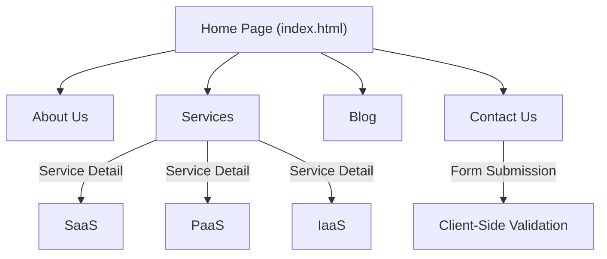

# Technical Specification: Cloud Services Website

## Architectural Overview

The **Cloud Services Website** is a responsive, multi-page static web application serving as a digital brochure for a cloud computing service provider. It is architected to effectively communicate service offerings, corporate identity, and contact information through a clean, navigational structure.

### Site Knowledge Map

---

## Technical Implementations

### 1. Frontend Architecture
-   **Structure**: The site is built on semantic HTML5, ensuring search engine optimization (SEO) and accessibility. Each page (`index.html`, `about_us.html`, `services.html`, etc.) operates as a standalone document linked via a consistent navigation bar.
-   **Styling**: CSS3 is used extensively to define the visual identity, employing flexbox and grid layouts for responsiveness. The design adapts to mobile, tablet, and desktop viewports.
-   **Assets**: Optimized images and icons located in the `assets/` directory are used to enhance the visual storytelling without compromising load times.

### 2. Interactive Elements
-   **Navigation**: A global navigation header allows for seamless transitions between site sections.
-   **Forms**: The contact page features a form interface designed for user inquiry collection.

### 3. Deployment Pipeline
-   **CI/CD**: The repository utilizes **GitHub Actions** to deploy the `Source Code` artifact to **GitHub Pages**, ensuring high availability and global content delivery.

---

## Technical Prerequisites

-   **Runtime**: Modern web browser.
-   **Dependencies**: None (Pure HTML/CSS).

---

*Technical Specification | Human Machine Interaction | Version 1.0*
